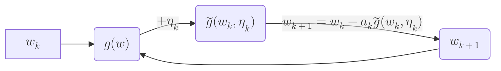

# 强化学习

## 学习

参考教程：[西湖大学 赵世钰 - 强化学习的数学原理](https://www.bilibili.com/video/BV1sd4y167NS)

::: tip 一些学习经验

- <switText text1="matrix form" text2="矩阵形式"/>的公式方便用于理论分析，而<switText text1="element-wise form" text2="分量形式"/>便于编程实现

:::

## 基础概念

> 为突出强调概念名词，紫色按钮是可通过点击转换中英文翻译的，<switText text1="like this" text2="像这样"/>

- <switText text1="state" text2="状态"/> agent 在环境中的状态，RL 中最关键的一个量，需要根据实际情况自己确定。所有状态放在一起就是状态空间，$\mathcal{S}=\{s_i\}$
- <switText text1="action" text2="行动"/> agent 在每一个状态都可能有一系列可能的行为，所有可能行为构成行为空间，$\mathcal{A}(s_i)=\{a_i\}$
- <switText text1="state transition" text2="状态转换"/> 当 agent 做出一个 action 后，agent 的状态会发生改变，不同的 action 有不同的 state 转换，定义了 agent 和环境交互的行为。
  - 确定情况(_deterministic_)：可以直接用矩阵表达，维度是 $\mathcal{S}\times \mathcal{A}$
  - 随机情况(_stochastic_)：用条件概率表达： $p(s_2|s_1. a_1)=0.2, p(s_i|s_1,a_2)=0.8(\forall i\ne 2)$
- <switText text1="policy" text2="策略"/> 告诉 agent 每个状态下要采取哪个行动。$\pi(a|s)$
  - 确定情况：$\pi (a_2|s_1) = 1, \pi (a_i|s_1) = 0(\forall i\ne 2)$ 表示在$s_1$状态下一定会采取$a_2$的行动；
  - 随机情况：$\pi (a_1|s_1) = 0.5,\pi (a_2|s_1) = 0.5, \pi (a_i|s_1) = 0(\forall i\ne 1,2)$ 表示在$s_1$状态下有对半开的概率采取 $a_1$ 或 $a_2$ 的行动；
- <switText text1="reward" text2="奖励"/> agent 采取行动后，给 agent 的一个反馈值，如果是正值则代表鼓励这种行为，如果是负数就代表惩罚这种行为，如果是 0 就代表没有惩罚（一定程度上是鼓励）。通过 reward 告诉 agent 应该怎么做，不该怎么做。奖励取决于当前状态和行动，而不是下一步的状态。奖励集合：$\mathcal{R}(s,a)$
  - 确定情况：用 table 表示，行表示状态，列表示行动，值表示奖励值
  - 随机情况：$p(r=-1|s_1,a_1)=0.5, p(r=1|s_1,a_1)=0.5$,表示在 $s_1$ 状态下采取 $a_1$ 状态，有 0.5 的可能性拿到-1 的奖励，也有 0.5 的可能拿到 1.
- <switText text1="trajectory" text2="轨迹"/> 状态-行动-奖励链。
- <switText text1="return" text2="采样"/> 沿着某条轨迹得到奖励值总和。
- <switText text1="discounted rate" text2="折合因子"/> $\gamma \in [0,1)$ 在达到目标之后，策略还在持续进行，会使得轨迹链变得无穷长，该轨迹的 return 也很大，所以要对每一步 policy 拿到的 reward 乘上一个折合因子（<1），使最后的 return 收敛。这样得到的 return 称作 discounted return. 
  原来的 return：$r_{1} = 0 + 0 + 0 + 1 + 1 + 1 + \cdots$  
  折合的 return：$r_{discounted,1} = 0 + \gamma \times 0 + \gamma^2 \times 0 + \gamma^3 \times 1 + \gamma^4 \times 1 + \gamma^5 \times 1 + \cdots$ 
  $=\gamma^3 (1+\gamma + \gamma^2 + \cdots) = \gamma^3 \frac{1}{1-\gamma}$
- <switText text1="episode" text2="回合"/> agent 按照策略与环境交互时，到达终点时 agent 会停止，由此产生的轨迹被称为 episode。episode 一般是有限步的。
- <switText text1="Markov Decision Process" text2="MDP，马尔科夫链"/>
  - 状态集合 $\mathcal{S}=\{s_i\}$，行动集合 $\mathcal{A}(s_i)=\{a_i\}$，奖励集合$\mathcal{R}(s,a)$
  - 状态转移概率 $p(s'|s,a)$，奖励概率 $p(r|s,a)$
  - 策略 $\pi(a|s)$
  - 马尔科夫特性：状态转移概率和奖励概率均具有历史无关性。 $p(s_{t+1}|a_t,s_t,\cdots,a_0,s_0) = p(s_{t+1}|a_t,s_t)$

## 贝尔曼公式

- 强化学习里一个单步的过程 
$$ S_t \overset{A_t}{\rightarrow}R_{t+1},S_{t+1}$$
- 多步过程
$$ S_t \overset{A_t}{\rightarrow}R_{t+1},S_{t+1}\overset{A_{t+1}}{\rightarrow}R_{t+2},S_{t+2}\overset{A_{t+2}}{\rightarrow}\cdots$$
则，折合采样：
$$G_t = R_{t+1} + \gamma R_{t+2} + \gamma^2 R_{t+3} + \cdots$$
$$=R_{t+1} +\gamma(R_{t+2}+\gamma R_{t+3}+\cdots)$$
$$=R_{t+1}+\gamma G_{t+1}$$
- <switText text1="state value" text2="状态值"/> $G_t$的期望值，$v_{\pi}(s)=\mathbb{E}[G_t|S_t=s]$，不同的策略会得到不同的轨迹，也就有不同状态值。return是针对单个轨迹的reward和，state value是针对该策略下所有可能轨迹的reward和的平均值。
$$v_{\pi}(s)=\mathbb{E}[G_t|S_t=s]$$
$$=\mathbb{E}[R_{t+1}+\gamma G_{t+1}|S_t=s]$$
$$=\mathbb{E}[R_{t+1}|S_t=s]+\gamma \mathbb{E}[G_{t+1}|S_t=s]$$
其中，
$$\mathbb{E}[R_{t+1}|S_t=s]=\Sigma_a [\pi(a|s)(\Sigma_r p(r|s,a)r)]$$
$$\mathbb{E}[G_{t+1}|S_t=s]=\Sigma_{s'} [v_{\pi}(s')(\Sigma_a p(s'|s,a)\pi(a|s))]$$
- <switText text1="Bellman Equation" text2="贝尔曼方程"/> $v_{\pi}(s)=\Sigma_a \{\pi(a|s)[(\Sigma_r p(r|s,a)r+\Sigma_{s'} v_{\pi}(s')\Sigma_a p(s'|s,a))]\}$
  - $\pi(a|s)$ 是给定的策略，某个状态下执行某个行动的可能性；
  - $p(r|s,a)$ 和 $p(s'|s,a)$ 代表动态模型，表示确定状态和行动之后，能够获得的奖励/状态转移概率，需要知道模型是否已知。 根据各项含义，可以继续简化式子：
  - $v_{\pi}(s)=r_{\pi}(s)+\gamma \Sigma_{s'}p_{\pi}(s'|s)v_{\pi}(s')$
    - $r_\pi(s)=\Sigma_a(\pi(a|s)\Sigma_r(p(r|s,a)r))$ 表示该策略下每一个状态可能得到的奖励的加权平均，即：即时奖励
    - $p_{\pi}(s'|s)=\Sigma_a(\pi(a|s)p(s'|s,a))$ 表示该策略下从当前状态转换到下一个状态的概率，即：状态转移概率 
  - 写成矩阵向量形式：$v_\pi = r_\pi + \gamma P_\pi v_\pi$
    - $v_\pi = [v_\pi(s_1),v_\pi(s_2),\cdots, v_\pi(s_n)]^T$
    - $r_\pi = [r_\pi(s_1),r_\pi(s_2),\cdots, r_\pi(s_n)]^T$
    - $P_\pi\in\mathbb{R}^{n\times n}, P_{\pi,i,j}=p_{\pi}(s_j|s_i)$,即状态转移概率矩阵。
- 在给定一个策略后，需要通过贝尔曼方程求解每一个状态的state value，这个过程叫作policy evaluation.由于求解贝尔曼方程需要求逆矩阵，所以为了防止奇异矩阵，在实际中一般采用迭代法求解，即：$v_{k+1}=r_\pi+\gamma P_\pi v_k$
- <switText text1="action value" text2="行动值"/> agent从一个状态出发，选择一个行动能够得到的return的平均值。$q_\pi(s,a)=\mathbb{E}[G_t|S_t=s,A_t=a]$。
  - 和state value的联系：$v_\pi(s)=\Sigma_a (\pi(a|s)q_\pi(s,a))$
  - $q_\pi(s,a) = \Sigma_r p(r|s,a)r+\Sigma_{s'} v_{\pi}(s')\Sigma_a p(s'|s,a)$

## 贝尔曼最优公式

- <switText text1="optimal policy" text2="最优策略"/> 如果一个policy下任意状态的state value都比另一个policy下任意状态的state value要大，那前一个policy就是optimal policy.
- <switText text1="Bellman optimality equation" text2="贝尔曼最优公式"/> $v_{\pi}(s)=\max_\pi \Sigma_a \{\pi(a|s)[(\Sigma_r p(r|s,a)r+\Sigma_{s'} v_{\pi}(s')\Sigma_a p(s'|s,a))]\}$ $=\max_\pi \Sigma_a \pi(a|s)q(s,a)$，其中$q(s,a)$代表action value
  - 矩阵形式：$v=\max_\pi (r_\pi + \gamma P_\pi v)$
  - 需要考虑的问题：
    - Algorithm：公式如何求解？
    - Existence：解是否存在？
    - Uniqueness：解是否唯一？
    - Optimality：为什么最优？
    - 目前已知的量有：$p(r|s,a)$, $\gamma$, $p(s'|s,a)$，这三个量分别代表奖励分布规律，折合因子，系统模型（采取什么行动后会到哪个状态）。
    - 目前未知的量有：$\pi(a|s)$, $v(s')$，一般我们会先给定一个$v(s')$的初始值，然后求解最优的$\pi(a|s)$
  - 如果我们把右侧的最优问题看成一个函数（因为$v$会初始给定），则最优公式转变成：$v=f(v)$，变成了一个经典的不动点（fixed point）问题。
- <switText text1="contraction mapping" text2="压缩映射"/> $f$是一个压缩映射的话，则有： $||f(x_1)-f(x_2)||\le \gamma ||x_1-x_2||$
  - 如果一个函数满足压缩映射，那他他一定存在唯一的一个不定点 $x^*$ ，使得 $f(x^*)=x^*$
  - 具体这个不动点怎么算呢，可以用迭代求，$x_{k+1}=f(x_k)$，当k趋于无穷大的时候，x会趋向于不动点，这个收敛是指数级别的。
- 记结论：贝尔曼公式是一个压缩映射函数，一定存在唯一一个不动点，且这个不动点就是方程的解。
- 求解最优贝尔曼方程的方法：
  - 迭代求不动点 $v^*$
  - 则 $\pi^* = \argmax_\pi (r_\pi + \gamma P_\pi v^*)$ 

## 值迭代和策略迭代

- <switText text1="state iteration" text2="值迭代"/> $v_{k+1}=f(v_k)=\max_\pi (r_\pi+\gamma P_\pi v_k)$
  1. policy update：**给定 $v_k$**，求解满足条件的 $\pi_{k+1}$, $\pi_{k+1}=\argmax_\pi(r_\pi +\gamma P_\pi v_k)$，是一个优化过程。这个优化问题的解法不难，是通过计算每一个状态对应每一个的行动的action value，取最大的那个action value就是当前最好的策略，如此反复迭代。
  2. value update：计算在$\pi_{k+1}$策略下的$v_{k+1}$,以此作为下一迭代步的初始值。
- <switText text1="policy iteration" text2="策略迭代"/> 
  1. policy evaluation：**给定初始策略 $\pi_0$**,求解该策略下的贝尔曼公式，得到$v_{\pi_k}$的state value，其中$v_{\pi_k}=r_{\pi_k}+\gamma P_{\pi_k}v_{\pi_k}$。在这一步过程中，求解 $v_{\pi_k}$ 就是在求解贝尔曼方程，有两种方法：1）逆矩阵，2）迭代。而我们不采用逆矩阵方法，所以在整个大的policy iteration框架下，还有一步小的迭代，这一步迭代是为了确定在给定策略条件下，各个状态的state value。
  2. policy improvement：$\pi_{k+1}=\argmax_\pi(r_\pi + \gamma P_{\pi}v_{\pi_k})$，选取在该state value下最大的action value，作为下一步的新策略。以此完成策略的迭代。
- *state iteration*和*policy iteration*对比

|步骤|策略迭代|值迭代|备注|
|:---|:---|:---|:---|
|1) Policy | $\pi_0$ |N/A||
|2) Value  | $v_{\pi_0}=r_{\pi_0}+\gamma P_{\pi_0}v_{\pi_0}$ |$v_0:=v_{\pi_0}$||
|3) Policy | $\pi_1=\argmax_\pi(r_{\pi}+\gamma P_{\pi}v_{\pi_0})$ | $\pi_1=\argmax_\pi(r_\pi + \gamma P_\pi v_0)$|两个策略是一样的|
|4) Value  | $v_{\pi_1} = r_{\pi_1} + \gamma P_{\pi_1}v_{\pi_1}$  | $v_1 = r_{\pi_1} + \gamma P_{\pi_1}v_0$ | 这步发生了不同|
|5) Policy | $\pi_2 = \argmax_{\pi}(r_\pi + \gamma P_{\pi}v_{\pi_1})$ | $\pi_2' = \argmax_{\pi}(r_{\pi} + \gamma P_{\pi}v_1)$ | |

在第四步求解的时候，策略迭代需要用迭代法求解贝尔曼公式，以此来得到 $v_{\pi_1}$ 的值，为了求这个值需要先给定一个初始估计值，然后迭代无穷步最后收敛值真实值。而值迭代，在第四步，是需要根据已知的初始值迭代一步得到下一次的新值。两者都是在用迭代法求解贝尔曼公式，策略迭代算了很多步，值迭代只算了一步。

- 由此引出*truncated policy iteration*，前面的算法一致，但是在这步只需要迭代有限步，不是只迭代一步，也不是非常多步，而是一个中间值。（初始给一个瞎猜的策略）

## 蒙特卡洛迭代法 <switText text1="non-incremental" text2="非增量式/非迭代式的"/>

之所以要提出蒙特卡洛，是因为在大多数情况下，我们是不知道系统模型的，无法使用贝尔曼公式。所以需要有大量的数据做支撑，来拟合出原有的数据分布概率模型。在蒙特卡洛方法里，旨在通过大量的尝试，推测出 $q_{\pi_k}(s,a)$ 的**期望值**。然后再采用policy iteration做迭代优化。通过 $v_\pi(s)=\Sigma_a (\pi(a|s)q_\pi(s,a))$ 计算下一步的 state value。

- 最基础的蒙特卡洛算法：要求从一个随机估计的策略出发，对每一个(s,a)，都遍历N个episode，求这N个episode的平均return值作为(s,a)状态-策略对的action value。
- *MC-based Exploring Starts*：遍历N个episode太过漫长，考虑任意一个episode链：$(s_1, a_1)\rightarrow (s_3, a_2)\rightarrow (s_2, a_4)\rightarrow (s_2, a_5)\rightarrow \cdots$ ，通过这个链，可以计算出 $(s_1, a_1)$ 的action value，同时还能够获得 $(s_2, a_4)$ 的action value，因为 $g_{(s_1,a_1)} = r_{(s_1,a_1)} + \gamma g_{(s_3, a_2)}$。然后这个方法，就把这一次的episode作为action value的估计值，代入policy iteration做优化 ~~（说是可以通过数学证明，证明出这样是依然收敛的，背结论吧，感觉后面多半不会用到）~~。
  - 在具体的编程实现中，建议逆序递推做累加，每一次都给return的值 $+\gamma g_{(s_{t}, a_{t})}$ ，就能计算出这条链上每一个 $(s,a)$ 的action value。
- *MC-based $\varepsilon$-greedy*：这里提出了*soft policy*的概念，也就是说每一个策略里每一个行动不是唯一确定的，而是有概率发生的，这个概率定义为：
  - 对于*greedy action*（就是action value最大的action），$\pi(a|s)=1-\frac{\varepsilon}{|\mathcal{A}(s)|}(\mathcal{A}(s)-1)$
  - 对于其他action，$\pi(a|s)=\frac{\varepsilon}{|\mathcal{A}(s)|}$
  - $\varepsilon$ 是[0,1]的一个正数，$\mathcal{A}(s)$ 是当前状态所拥有行动的数目。
  - 之所以会选择用*soft policy*是为了平衡 **exploitation** 和 **exploration**，平衡探索性和最优性。
  > $\varepsilon$-greedy 其实就是把原来是确定性的 $\pi(a|s)$ 转换成了stochastic的情况。

## 【数学基础】随机近似与随机梯度下降

- <switText text1="incremental" text2="增量式"/>方法计算平均数。设置 $w_k=\frac{1}{k+1}\Sigma_i^N \frac{1}{N}x_i$，则可以通过推导推出递推关系式：==$w_{k+1}=w_k-\frac{1}{k}(w_k-x_k)$==。为什么要这么做呢？因为有时候数据量太大了，要是来一个采样数据就需要重新全部加起来算平均值，对算力要求是很高的。而有了递推式，就可以做到来一个采样，就只要一步计算就能得到加上这个采样后的新平均值，简化运算要求。这是一个特殊的<switText text1="Robbins-Monro算法" text2="RM"/>
- <switText text1="Robbins-Monro算法" text2="RM"/>：类似于随机梯度下降。其目的是解决一个黑箱函数的解。举个例子，我有一个函数 $g(w)=0$, 这个函数$g$是什么我不知道，但是我想要正确的解 $w^*$，这个就引入了迭代式的RM算法。即： $w_{k+1} = w_k - a_k \tilde{g}(w_k, \eta_k)$
  - $w_{k+1}$ 是下一步需要输入的输入值
  - $a_k$ 是正的系数。一般取接近于0的常数。如果 $a_k=\frac{1}{k}$，$g(w)=w-x$，则就转变成了<switText text1="incremental" text2="增量式"/>方法计算均值。
  - $\tilde{g}(w_k, \eta_k)$ 这步是输入$w_k$后模型的响应**观察量**，是包括噪声的，噪声也未知
  - 关于这个定理的运用，数学上要求满足一定的条件，太复杂了，暂且不论。

- 对于优化问题： $\min_w J(w)=\mathbb{E[f(w,X)]}$（w是参数，X是已知概率分布的随机变量，$J(w)$是求期望），有多种解法
  - <switText text1="Gradient Descent" text2="GD，梯度下降"/> 
  $$w_{k+1} = w_k-a_k\nabla_w \mathbb{E}[f(w_k, X)]$$ 
  但是这个$\mathbb{E}[]$期望很难求。要么用模型，要么用数据。
  - <switText text1="Batch Gradient Descent" text2="BGD，批量梯度下降"/> 用数据求期望：
  $$w_{k+1} = w_k-a_k \frac{1}{n}\Sigma_{i=1}^n\nabla_wf(w_k, X)$$
  但是每一次计算$w_{k+1}$,都得采样好多次，这在实际中也不太行
  - <switText text1="Stochastic Gradient Descent" text2="SGD，随机梯度下降"/> 
  $$w_{k+1} = w_k-a_k\nabla_w f(w_k, X)$$ 
  相当于只采了一次样的<switText text1="Batch Gradient Descent" text2="BGD，批量梯度下降"/>

## 时序差分算法 <switText text1="incremental" text2="增量式/迭代式的"/>

- <switText text1="Time Difference" text2="TD算法（时序差分算法）"/> 
  $$v_{t+1}(s_t)=v_t(s_t)-\alpha_t(s_t)[v_t(s_t)-[r_{t+1}+\gamma v_t(s_{t+1})]]$$
  $$v_{t+1}(s)=v_t(s), \forall s\ne s_t\text{（所有没被访问的状态，其state value保持不变）}$$
  - $v_{t+1}(s_t)$ 新的估计值
  - $v_t(s_t)$ 当前估计值
  - $r_{t+1}+\gamma v_t(s_{t+1})$ TD目标值 $\bar{v}_t$
  > **为什么这个目标值是 $\bar{v}_t$？**
  >
  > 把最原始的公式变换为：$v_{t+1}(s_t)=v_t(s_t)-\alpha_t(s_t)[v_t(s_t)-\bar{v}_t]$
  >
  > $$v_{t+1}(s_t) - \bar{v}_t=v_t(s_t)-\bar{v}_t-\alpha_t(s_t)[v_t(s_t)-\bar{v}_t]$$
  > 
  > $$v_{t+1}(s_t) - \bar{v}_t=(1-\alpha_t(s_t))[v_t(s_t)-\bar{v}_t]$$
  >
  > $$|v_{t+1}(s_t) - \bar{v}_t|=|1-\alpha_t(s_t)||v_t(s_t)-\bar{v}_t|$$
  >
  > $$v_{t+1}(s_t) - \bar{v}_t \le [v_t(s_t)-\bar{v}_t]$$
  > 
  > 意味着 $v_{t+1}(s_t)$ 和 $\bar{v}_t$ 之间的误差越来越小，也就是说逐渐向着 $\bar{v}_t$ 逼近。$
  - $v_t(s_t)-[r_{t+1}+\gamma v_t(s_{t+1})] = v_t(s_t) - \bar{v}_t$ TD误差 $\delta_t$
  > 注意我们要估计的值是 $v_\pi$，误差可以写作 $\delta_{\pi, t} \doteq v_\pi(s_t)-[r_{t+1}+\gamma v_\pi(s_{t+1})]$
  >
  > $$\mathbb{E}[\delta_{\pi,t}|S_t=s_t]=v_{\pi}(s_t)-\mathbb{E}[R_{t+1}+\gamma v_\pi(S_{t+1})|S_t=s_t]=0$$
  > 
  > 所以能证明这个参数的期望是0，也就可以用于表示误差。
  >
  > TD误差也可以表示innovation,我们发现新的信息和现在有误差，所以就借用新信息来改进当前策略。
  - 如果参考RM算法，时序差分公式给出来的其实是 $w = v_{t}(s_t) = \mathbb{E}[r_{t+1}+\gamma v_t(s‘)|S=s]$ 而这个其实是贝尔曼期望公式，和[贝尔曼公式](#贝尔曼公式)类似，由此TD算法实现了**不用模型的情况**求解贝尔曼公式，但是给到相对应的数据（包括了对 $R$ 和 $v_\pi (S')$ 的采样）。
    - 而现在需要的是 $(s,r,s')$ 的采样，一般会替换成 $(s_t,r_{t+1},s_{t+1})$ 的轨迹，这样访问到哪个s，就可以更新哪个s的采样，而不用反复做某一个s的采样。